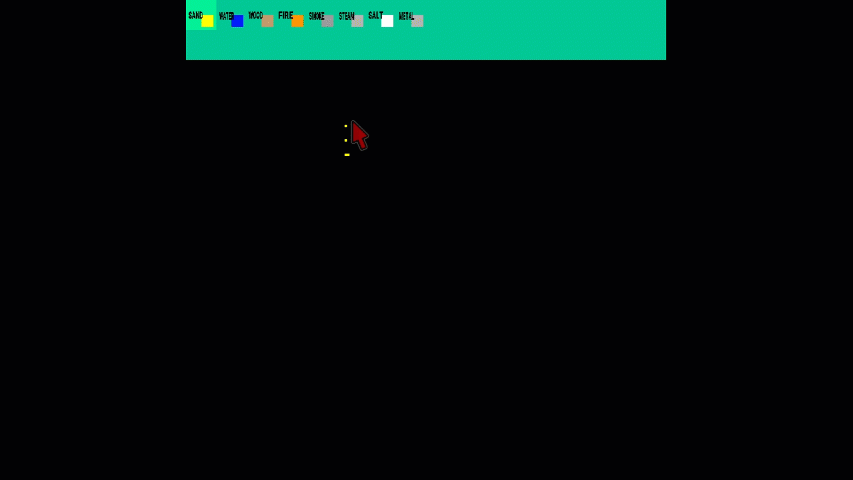

## ABOUT:
> This is a small sandbox game I decided to do after viewing a video in the graphics programming reddit. It is a work in progress that I will do during my free time. I plan on adding a variety of blocks and block interactions. Chunk rendering has been added which might lead to the implementation of procedurally generated terrain/worlds.
## BUILDING
* SDL2 developer packages need to be installed
	* **Linux**: *sudo apt-get install libsdl2-dev*
	* **Windows**: [Tutorial](https://www.matsson.com/prog/sdl2-mingw-w64-tutorial.php)
* SDL2_ttf must also be installed for font loading
	* **Linux**: *sudo apt-get install libsdl2-ttf-dev*
	* **Windows**: Development libraries for Windows can be found [here](https://www.libsdl.org/projects/SDL_ttf/)
---
Once every dependency is installed, you can build on Linux with the makefile provided by typing "make" in the same directory. For Windows, the makefile might need to be tweaked.
## PROGRAM USE
* Left click draws single particle at mouse location(if on screen)
* Holding left click continually draws particles
* Right click deletes particles falling within a certain radius of the mouse
* Holding right click continually deletes particles
* 'm' button displays a menu where you can click to change between the particles being drawn
* Hold left or right arrow keys to traverse through the generated chunks
## DEBUGGING
* Holding left shift key and left clicking on the screen displays the closest cell's info along with its chunk id
* Info gets written to local logInfo.txt file
* 'f1' displays grid-like system, white squares represent single particles and red squares represent entire chunks
## BETA 1

## BETA 2

